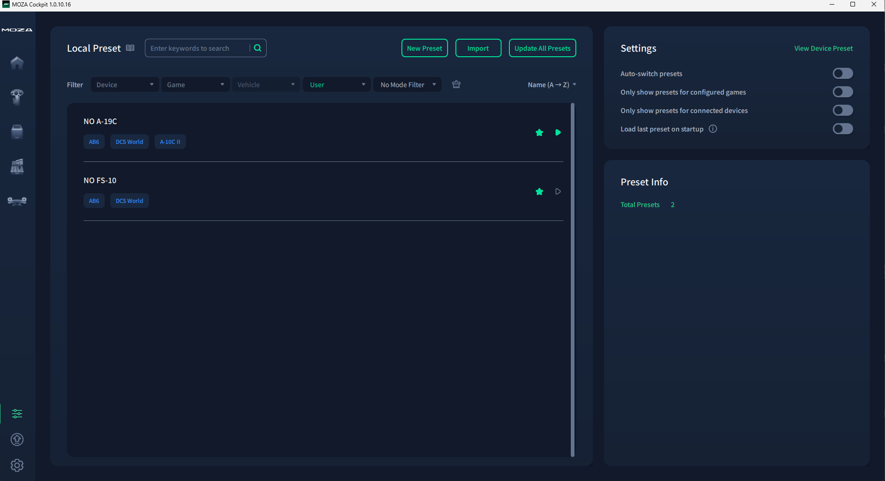
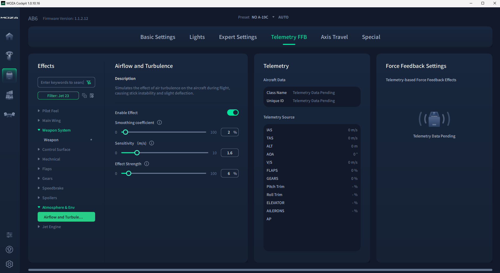

# Zorduzd: Nuclear Option Moza FFB Support
Zorduzd is a tiny mod to enable force feedback on Moza flight sticks in Nuclear Option.
Nuclear Option on its own actually does not support any form of force feedback.


## How to Use

1. Install [BepInEx 5](https://docs.bepinex.dev/articles/user_guide/installation/index.html) into your Nuclear Option game directory. You should optionally install [BepInEx configuration manager](https://github.com/BepInEx/BepInEx.ConfigurationManager) too.

2. Copy `zorduzd.dll` into `BepInEx/plugins/`.
3. Run `DCS.exe` (the proxy app).
4. Open Moza Pit House and make sure the DCS World FFB profile is enabled.
5. Launch Nuclear Option and fly something.

The Moza Cockpit software will connect to `DCS.exe` on port `3476` and start applying force feedback effects.
The plugin streams telemetry to `DCS.exe` on port `3480`. 
Both ports are configurable:
1. Plugin: while in game press `f1` (requires [BepInEx configuration manager]) and modify the port the game uses to stream its data.
2. `DCS.exe`: before starting the program, modify `zorduzd.cfg` (if it does not exists, run `DCS.exe` once and quite) to set your desired ports. `moza` must match the port that Moza Cock pit sets for DCS and the `game` port must match the one from step 1.


## Configuring the FFB Feel
To configure how the FFB feels, you must open Moza Cockpit and load or create your profile.
At the moment, the mod make Moza cockpit believe that DCS and that the user is flying an A-10C-II Warthog. 
This is probaly good representation for the A-19 aircraft in Nuclear Options but for others, you must create and load your desired profile.
Additionally, Moza does not enable lots of cool FFB effects like wind turbulance, or even weapon discharge, so even with the default A-10C-II config, you  might want to turn on and adjust more effects.
E.g., here is what I have:



## How it works

### A BepInEx plugin

The C# component (`zorduzd.dll`) is a BepInEx 5 plugin that hooks into the Unity runtime of Nuclear Option. On every physics tick it reads telemetry from the player's aircraft: acceleration, G-force, airspeed, angle of attack, engine RPM, gear state, control surface inputs, countermeasures, and more. 
It serializes this data as semicolon-separated key-value pairs and sends it over a local TCP connection (default port `3480`).

### A DCS "Faker"

The Rust component (`DCS.exe`) is a GUI proxy that sits between the game plugin and the Moza Cockpit software. It:

1. Listens on the Moza Cockpit's expected DCS port (`3476`) and waits for Moza Pit House to connect.
2. Connects to the BepInEx plugin's TCP stream (`3480`) to receive telemetry from Nuclear Option.
3. Translates the telemetry into the same key-value format that DCS World's `MOZA.lua` export script produces.
4. Forwards the translated data to Moza Cockpit, which treats it exactly as if DCS World were running.

The name `DCS.exe` is intentional: Moza Pit House auto-detects running processes by name to enable its FFB profiles.

## Building

### Requirements

- Rust toolchain (edition 2024)
- .NET SDK (targeting `netstandard2.1`)
- `Assembly-CSharp.dll` and `Mirage.dll` from your Nuclear Option install

### Build

```
cargo build
```

The `build.rs` script handles everything:
- Copies `Assembly-CSharp.dll` and `Mirage.dll` from the default Steam path into `ext/` if they aren't there already. Set the `NUCLEAR_OPTION_PATH` environment variable to override the lookup path.
- Runs `dotnet build` for the BepInEx plugin.
- Places `zorduzd.dll` next to `DCS.exe` in `target/debug/` (or `target/release/`).

### Version Management

Versions are managed through `Cargo.toml` using [`cargo-release`](https://github.com/crate-ci/cargo-release). Running `cargo release` bumps the version in `Cargo.toml`, `src/zorduzd.csproj`, and `src/Plugin.cs` simultaneously.

# Inspiration & Credit
## [Falcon BMS to Moza FFB Mapper](https://github.com/Picroc/falcon-bms-to-moza-ffb?tab=readme-ov-file#falcon-bms-to-moza-ffb-mapper)
This a program that basically makes the Moza Cockpit think "DCS" is running and providing telemetry data.
I was insipred by this trick to make Zorduzd without having to deal with calculating effects myself.
## [NOFFB (Force Feedback Plugin for Nuclear Option)](https://github.com/KopterBuzz/NOFFB?tab=readme-ov-file)
This a force feedback mod for Nuclear Option that (at the time of writing) uses direct input, so it should work for any controller.
I made my own mod after stumbling upon NOFFB. This was quite helpful for me to learn about the BepInEx plugin system for Unity.
