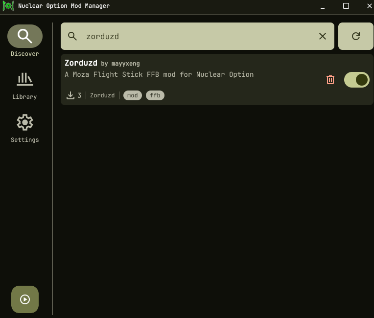
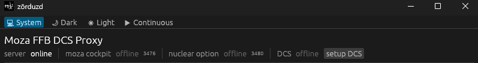
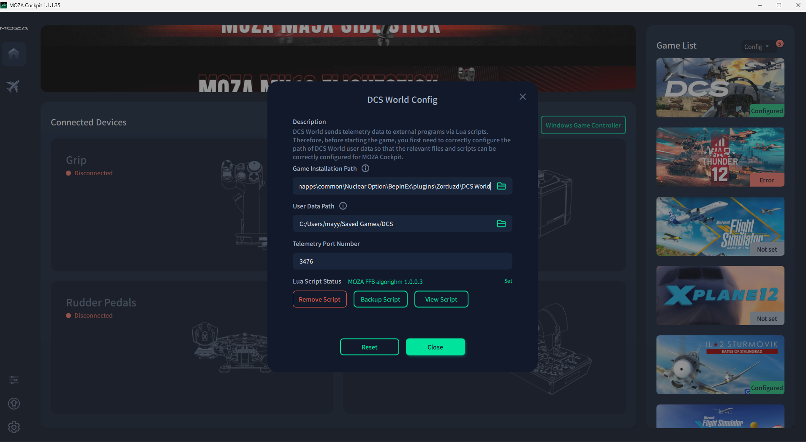
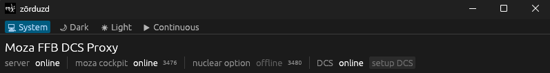
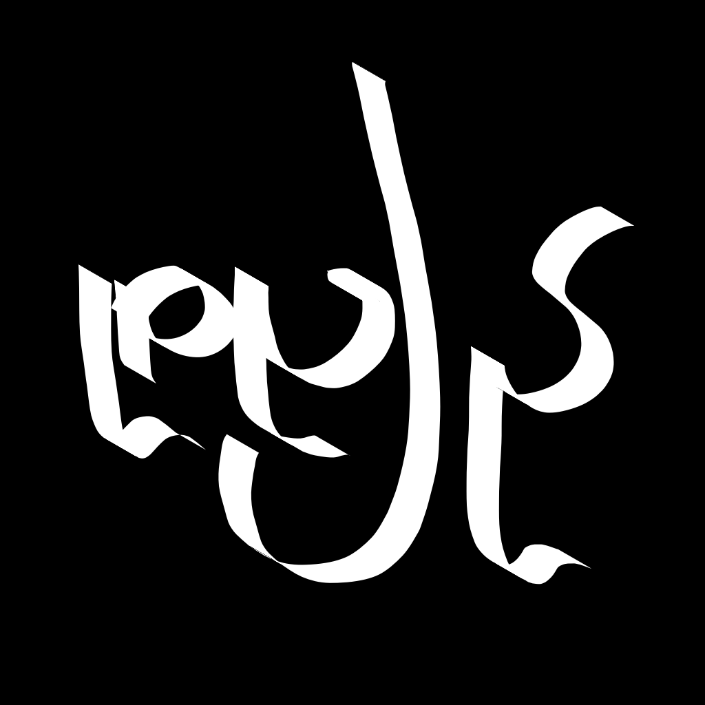

# Zōrduzd: Nuclear Option Moza FFB Support
Zorduzd is a tiny mod to enable force feedback on Moza flight sticks in Nuclear Option.

# Table of Contents
// fill later

# How to Use
## Using Nuclear Option Mod Manager (NOMM)
If you've [NOMM](https://github.com/Combat787/NOMM/releases), then the setup process is quite easy, simply look for `zorduzd` in NOMM and install it.
<div style="width: 50%; align">
    
</div>
This will install a bunch of files under the plugin directory managed by `NOMM`, e.g., it could be:

```
C:\Program Files (x86)\Steam\steamapps\common\Nuclear Option\BepInEx\plugins\Zorduzd
```
(of course, you might have different address based on the game install location.)
In this directory you shall find the following content:
```
 Zorduzd/
    ├── DCS World/bin/
    │   ├── DCS.exe
    │   └── zorduzd.cfg      # might not exist
    ├── zorduzd.dll
    ├── zorduzd.deps.json
    └── zorduzd.pdb
```
You need to run `DCS.exe` at the same time the game is running to enable FFB.
Basically, this program tries to make Moza Cockpit _think_ that [DCS](https://www.digitalcombatsimulator.com/en/) is running.
This way, by sending good telemetry data to Moza Cockpit, we can make it apply force feeback to your flight stick. 

## Configuring Moza Cockpit

If you have DCS installed on your system, and you've configured Moza Cockpit with it, then you are good too go.
Otherwise, run `DCS.exe` from the mode (under `Zorduzd\DCS World\bin\DCS.exe`).
This should open up an application that looks like this:
<div style="width: 50%; align">
    
</div>
Here there are 4 status indicators:

| Indicator      | Description                                                                | Requires Manual Work                       |
| -------------- | -------------------------------------------------------------------------- | ------------------------------------------ |
| server         | whether the app  was able to create a TCP server to listen on Moza Cockpit | No                                         |
| moza cockpit   | whether moza cockpit successfully connected to the app                     | Yes, see [blow](#configuring-moza-cockpit) |
| nuclear option | whether the game is running and connected to the app                       | No                                         |
| DCS            | whether you have a valid DCS setup with Moza cockpit                       | Yes, see [blow](#configuring-moza-cockpit) |

If your here, then `DCS` is probably indicated as __offline__, and a `setup DCS` button must be clickable. 
Click on it!
This will create `DCS` folder under `%USERPROFILE%\Saved Games`, e.g., that's `C:\Users\John Doe\Saved Games`.
Now, open up Moza Cockpit and select `DCS` from the left panel:
<div style="width: 80%; align">
    
</div>

The _Game Installation Path_ must point to the `DCS World` directory installed by the mod, e.g., that's
```
C:\Program Files (x86)\Steam\steamapps\common\Nuclear Option\BepInEx\plugins\Zorduzd\DCS World
```
For me.

The _User Data Path_ must point to the directory created by the previous step, i.e., when you clicked on `setup DCS` in the fake `DCS` app.
The _Telemetry Port Number_ must also match the port number you saw earlier in the fake `DCS` app.

With all done, you should reopen `DCS.exe` and this time see:
<div style="width: 50%; align">
    
</div>

Now you if you run the game, _nuclear option_ must also become online and you should get some force feedback.

To better adjust the force feedback, you have to play with Moza cockpit, e.g., [see here](#configuring-the-ffb-feel).


## By Manual Download

1. Install [BepInEx 5](https://docs.bepinex.dev/articles/user_guide/installation/index.html) into your Nuclear Option game directory. You should optionally install [BepInEx configuration manager](https://github.com/BepInEx/BepInEx.ConfigurationManager) too.
2. Download the latest release.
3. Copy the extracted release files into `BepInEx/plugins/`.
4. Follow [configuring moza cockpit](#configuring-moza-cockpit)
5. Run the game and enjoy
6. Fine adjust your experience by following [configuring the FFB feel](#configuring-the-ffb-feel)

The Moza Cockpit software will connect to `DCS.exe` on port `3476` and start applying force feedback effects.
The plugin streams telemetry to `DCS.exe` on port `3480`. 


## Configuring the Ports
You should probably never do this, but you can change the ports the game and the fake `DCS` app communicate.
1. Plugin: while in game press `f1` (requires [BepInEx configuration manager]) and modify the port the game uses to stream its data.
2. `DCS.exe`: before starting the program, modify `zorduzd.cfg` (if it does not exists, run `DCS.exe` once and quite) to set your desired ports. `moza` must match the port that Moza Cock pit sets for DCS and the `game` port must match the one from step 1.


## Configuring the FFB Feel
To configure how the FFB feels, you must open Moza Cockpit and load or create your profile.
At the moment, the mod make Moza cockpit believe that DCS and that the user is flying an A-10C-II Warthog. 
This is probaly good representation for the A-19 aircraft in Nuclear Options but for others, you must create and load your desired profile.
Additionally, Moza does not enable lots of cool FFB effects like wind turbulance, or even weapon discharge, so even with the default A-10C-II config, you  might want to turn on and adjust more effects.
E.g., here is what I have:
<div style="display: flex; padding: 10px">
    <div style="padding: 10px; width: 50%">
        
    </div>
    <div style="padding: 10px; width: 50%">
        
    </div>
</div>


## How it works

### A BepInEx plugin

The C# component (`zorduzd.dll`) is a BepInEx 5 plugin that hooks into the Unity runtime of Nuclear Option. On every physics tick it reads telemetry from the player's aircraft: acceleration, G-force, airspeed, angle of attack, engine RPM, gear state, control surface inputs, countermeasures, and more. 
It serializes this data as semicolon-separated key-value pairs and sends it over a local TCP connection (default port `3480`).

### A DCS "Faker"

The Rust component (`DCS.exe`) is a GUI proxy that sits between the game plugin and the Moza Cockpit software. It:

1. Listens on the Moza Cockpit's expected DCS port (`3476`) and waits for Moza Pit House to connect.
2. Connects to the BepInEx plugin's TCP stream (`3480`) to receive telemetry from Nuclear Option.
3. Translates the telemetry into the same key-value format that DCS World's `MOZA.lua` export script produces.
4. Forwards the translated data to Moza Cockpit, which treats it exactly as if DCS World were running.

The name `DCS.exe` is intentional: Moza Pit House auto-detects running processes by name to enable its FFB profiles.

## Building

### Requirements

- Rust toolchain (edition 2024)
- .NET SDK (targeting `netstandard2.1`)
- `Assembly-CSharp.dll` and `Mirage.dll` from your Nuclear Option install

### Build

```
cargo build
```

The `build.rs` script handles everything:
- Copies `Assembly-CSharp.dll` and `Mirage.dll` from the default Steam path into `ext/` if they aren't there already. Set the `NUCLEAR_OPTION_PATH` environment variable to override the lookup path.
- Runs `dotnet build` for the BepInEx plugin.
- Places `zorduzd.dll` next to `DCS.exe` in `target/debug/` (or `target/release/`).

# Inspiration & Credit
## [Falcon BMS to Moza FFB Mapper](https://github.com/Picroc/falcon-bms-to-moza-ffb?tab=readme-ov-file#falcon-bms-to-moza-ffb-mapper)
This a program that basically makes the Moza Cockpit think "DCS" is running and providing telemetry data.
I was insipred by this trick to make Zorduzd without having to deal with calculating effects myself.
## [NOFFB (Force Feedback Plugin for Nuclear Option)](https://github.com/KopterBuzz/NOFFB?tab=readme-ov-file)
This a force feedback mod for Nuclear Option that (at the time of writing) uses direct input, so it should work for any controller.
I made my own mod after stumbling upon NOFFB. This was quite helpful for me to learn about the BepInEx plugin system for Unity.

<sup>
Zōrduzd means "Force Stealer" in Persian (زوردزد).
</sup>
</br>
<sup>
Licensed under <a href="LICENSE.md">MIT license</a>.
</sup>
</br>

